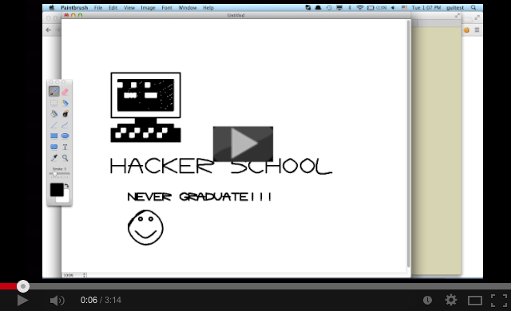

# mouse-driver

This is a little library which uses Java's java.awt.Robot class to drive the mouse cursor.
This allows to draw pictures within other applications (such as MS Paint and the like).
The driver makes use of natural cubic splines in order to smoothen mouse movements.

The idea is that you specify the text and the symbols to draw and the driver then translates
this into mouse movements. This allows to draw text and figures in external applications
like e.g. MS Paint etc.

## Usage

Start up a REPL (if you have leiningen installed just type: "lein repl").
Open up your favorite graphical editor and set it up so that you can draw lines with the left mouse button. Then
switch back to the REPL and type: "(demo)". Switch back to your editor and watch what happens ;-)

Watch the video:

